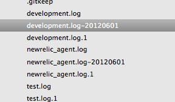

!SLIDE center
# Logrotate #

!SLIDE subsection
# Pop quiz, hot shot #

!SLIDE bullets incremental
# The scenario... #

* You put a ton of effort into building a great app
* It's fast
* It's tested

!SLIDE subsection
# Just one problem #

!SLIDE center transition=uncover
# The server keeps crashing #

!SLIDE bullets incremental
# Why? #

* Turns out the logs are too big
* The RAM is full
* There is no disk space
* This causes problems debugging

!SLIDE center
# You're not alone #

* This is actually one of the most common ways a junior sys-admin can mess up a server

!SLIDE subsection
# How to prevent this #

!SLIDE center transition=scrollUp
# Rotate your logs #

!SLIDE center bullets
# The good news #

* It's surprisingly easy(*) to avoid

!SLIDE subsection transition=fade
# Enter logrotate #

!SLIDE
# What Is It? #

* a utility to manage and administer log files

!SLIDE bullets incremental
# How it Works #

* set up in a config file
* runs as a cron job
* takes the log file, copies the data into another file that is timestamped in a directory you specify
* deletes older logs after certain time
* most operating systems(*) have it installed

!SLIDE bullets incremental
# Some Features #

* rotated a number of times before getting deleted
* allows automatic rotation, compression, removal, and mailing of log files
* each log file may be handled daily, weekly, monthly, or when it grows too large

!SLIDE bullets
# Why it's useful #

* logs have short-term value
* when they are rotated, you get rid of the invaluable stuff

!SLIDE subsection
# When isn't it useful? #

!SLIDE bullets incremental transition=scrollUp
# It's always useful #

* It's an easy way to stay organized and keep your logs manageable
* And therefore stay...performant?

!SLIDE subsection
# Example #

!SLIDE commandline incremental

  $ brew install logrotate

  $ export PATH=${PATH}:/usr/local/sbin

!SLIDE
# Sample config in /etc/logrotate.d/ #

    @@@ diff 
    /Users/travisvalentine/hungry-projects/feed_engine/log/*.log {
      size 0k
      missingok
      rotate 7
      compress
      delaycompress
      notifempty
      copytruncate
    }

!SLIDE commandline incremental

  $ logrotate -f <configfile>

!SLIDE center
# Result #

!SLIDE center bullets
# Resources #

* Logrotate on [linuxcommand.org](http://linuxcommand.org/man_pages/logrotate8.html)
* Tutorial on logrotate for [Rails](http://nullislove.com/2007/09/10/rotating-rails-log-files/)
* My [gist](https://gist.github.com/2848862) with the code from this presentation